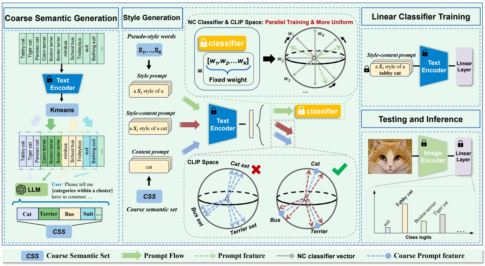

# BatStyler: Advancing Multi-category Style Generation for Source-free Domain Generalization



## Dataset

- ImageNet-R: https://github.com/hendrycks/imagenet-r
- DomainNet: http://ai.bu.edu/DomainNet/
- ImageNet-S: https://drive.google.com/file/d/1Mj0i5HBthqH1p_yeXzsg22gZduvgoNeA/view

## Requirements

#### How to Start:

```bash
conda env create -f environment.yaml
```

#### Model Architecture

```bash
cd ./dassl/engine/batstyler
```

### Training & Inference

```
# Training
cd ./batstyler/scrip
sh kmeans.sh
sh train.sh
```

Please note that the current default text template used for training is 'a X style of a CLS'. Before training, please add the categories under ./batstyler/semantics.

```
# Inference
sh test.sh
```

